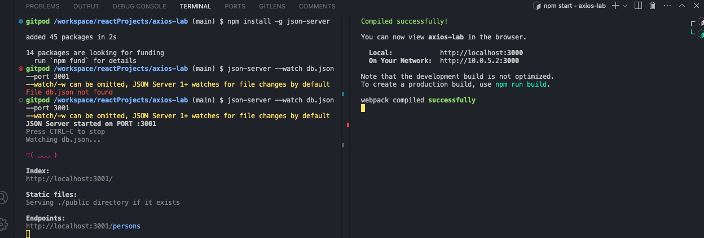
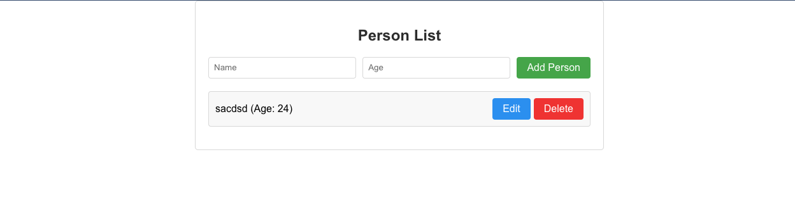
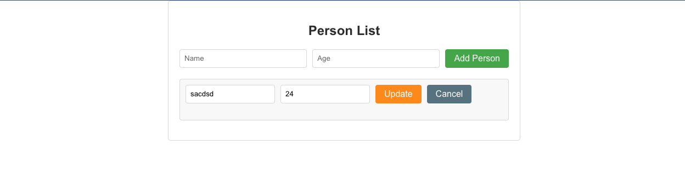

### install axios

```bash
npm install axios
```

### Setup a temporary database

- Install the json-server package to hold a json file as the temp db.
    ```bash
    npm install json-server
    ```

- Create a db.json file and add sample data in it
    ```json
    {
    "persons": [
        { "id": 1, "name": "Alice", "age": 25 },
        { "id": 2, "name": "Bob", "age": 30 }
    ]
    }
    ```

- Run the db
    ```bash
    json-server --watch db.json --port 3001
    ```
### Run the application

- Run the db in one tab first and then the application in another tab
- make the server and db public so that they can access each other


### The output looks something like this

- **Entry page**


- **Edit page**
